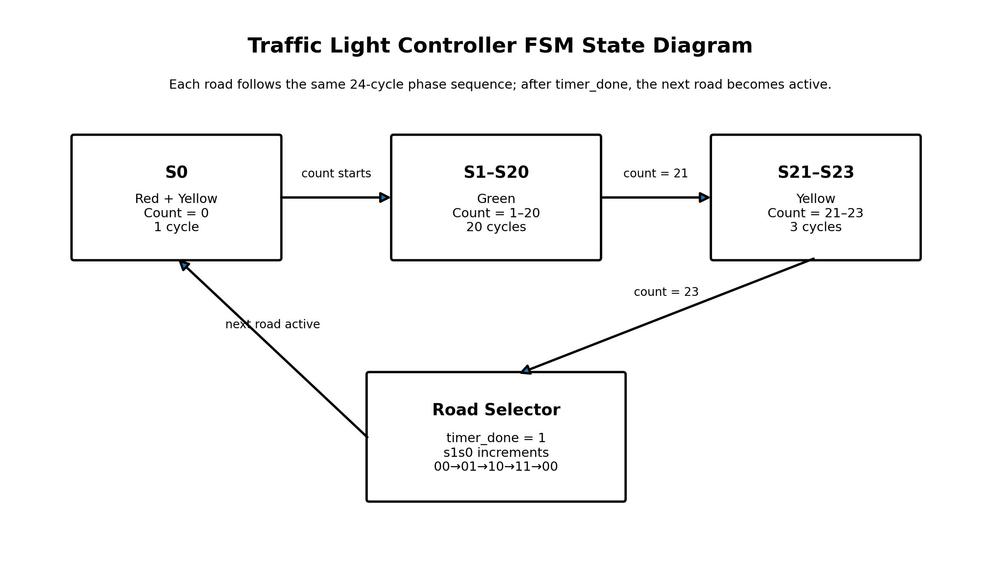
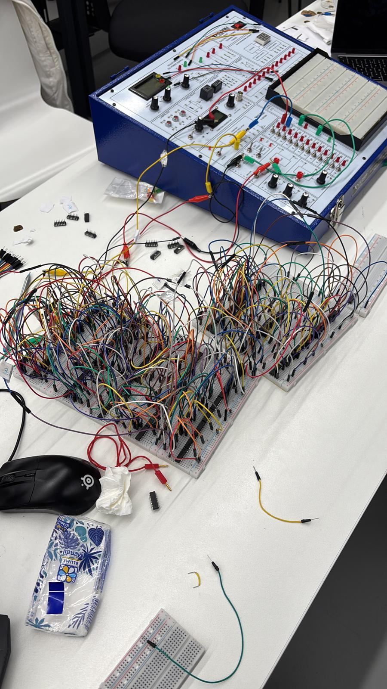

# 🚦 Traffic Light Controller (FSM - Verilog & Digital Logic)

##  Project Overview
In this project, a 4-way traffic light controller was designed using both digital logic (Logisim) and Verilog HDL.

The main goal was to understand how a real traffic system can be implemented without using a microcontroller, only with flip-flops and logic gates. The system works as a finite state machine (FSM) and changes the traffic lights in a fixed sequence.

---

##  Features
- 4-direction traffic light system  
- FSM-based sequential design  
- 24-cycle timing system  
- Automatic switching between roads  
- Clock-based synchronous operation  

---

##  System Structure
The design consists of two main parts:

- A timer (5-bit counter) that counts from 0 to 23  
- A road selector (2-bit) that determines which road is active  

When the timer completes one cycle, the next road becomes active.

---

##  FSM State Diagram

---

##  Timing

The system operates in a 24-cycle loop.

| Phase | Count | Duration |
|------|------|---------|
| Red + Yellow | 0 | 1 cycle |
| Green | 1–20 | 20 cycles |
| Yellow | 21–23 | 3 cycles |

---

##  Time (Example)

If 1 clock cycle is equal to 1 second:

- Green → 20 seconds  
- Yellow → 3 seconds  
- Red + Yellow → 1 second  

---

##  Red Light Behavior
Each road stays red while the other roads are active.

Total system cycle:
4 roads × 24 cycles = 96 cycles

For one road:
- Green = 20 cycles  
- Yellow = 3 cycles  
- Red + Yellow = 1 cycle  
- Red = remaining time (approximately 72 cycles)  

---

##  Hardware Implementation
The system was also implemented using physical components:

- D Flip-Flops  
- Logic gates (AND, OR, NOT)  
- Breadboard connections  

---

##  Verilog Implementation

Main file:
src/traffic_light.v

---

##  Simulation Notes

During the simulation, the timing was not always perfectly aligned with the theoretical values. There were some small deviations in the duration of the light phases.

However, the overall logic of the system worked correctly:
- The state transitions were consistent  
- The traffic flow sequence was correct  
- No conflicting signals were observed  

---

##  Evaluation and Notes

The project was evaluated with a score of **80/100**.

Point deductions were mainly due to:
- The circuit not being fully implemented in Logisim  
- Minor timing inaccuracies and synchronization issues  

Additionally, the project was recognized for having one of the best visual designs.

---

##  Demo

media/demo.mp4

---
│   ├── hardware.jpg
│   └── demo.mp4
│
├── README.md
